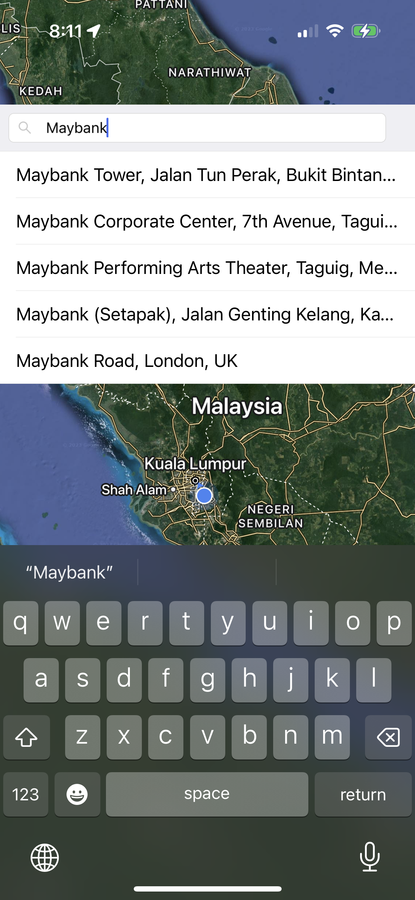

# Place Search

A simple React Native + TypeScript integrated Google Place Autocomplete to find places and show at map.

## Components

 - React Native
 - TypeScript
 - Redux Observable Epics
 - Ant Design Mobile RN
 - react-native-maps

## Screenshots

  

## Run the app

1. Install all the dependencies

```
$ yarn install
```

2. Add the `.env` file to the project. Follow the `.env.template` format.

```
GMAP_KEY=yourApiKey
```

3. Run the app.

Run using Xcode if using a physical iOS device

or

Run this command if using iOS simulator

```
$ npx react-native run-ios
```

or 

Run this command if using Android emulator or Android physical device.

```
$ npx react-native run-android
```